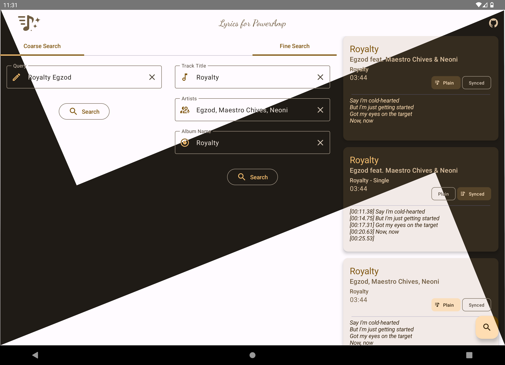

 

 

A lyrics plugin for [Poweramp](https://powerampapp.com/)  

### :flower_playing_cards: Screenshots

### :shield: Permissions

- **Internet**: Required for fetching lyrics from LRCLib.
- **Notification**: Displays status of lyrics requests.

### :wrench: Setup and Usage

No changes are required in Poweramp settings to use this app.

This app is a lyrics plugin, not a standalone lyrics app.
You cannot directly view lyrics in this plugin or select it as a _Preferred Lyrics App_ in Poweramp
settings.

Poweramp automatically sends a lyrics request when it doesn't have lyrics available for a track.

- #### App settings

    - #### Theme
      You can manually change the app's theme.
      Devices running Android 10+ can choose system default mode to follow system theme.

    - #### Lyrics Request.

        - #### Fallback to Search Method
          If the plugin
          cannot [find the best match](https://lrclib.net/docs#:~:text=Get%20lyrics%20with%20a%20track's%20signature),
          it will fallback to
          a [search method](https://lrclib.net/docs#:~:text=Search%20for%20lyrics%20records) which
          may occasionally retrieve incorrect lyrics.

        - #### Notify on Lyrics Request Failure
          If the lyrics request fails, the app posts a notification. From this notification, you can
          launch the plugin prepopulated with track metadata to perform a manual search and update
          the lyrics.

        - #### Replace previous notification
          Enabling this option replaces the previous notification with a new one, preventing the
          notification panel from being flooded with failure notifications.
          However, this means you can perform manual search only for the most recent failed track.
        - #### Preferred Lyrics Type
          Choose whether the app should always try to send synced or plain lyrics to Poweramp.
          If the chosen type is not available for a track, the other type will be sent if available.

    - #### Filters
      You can specify filters for the title, artist, and album fields to remove matches from the
      corresponding search parameter.
      Filters can be strings or regular expressions.  
      For example, to exclude strings like `320kbps` from track title, enter `\d{3}kbps` in the
      title filter box. This will remove any such matches from the title.

- #### Search Modes

  The app offers two search options:

    * **Coarse Search**: Performs a keyword-based search that yields a broad range of results.
      This method sacrifices accuracy for quantity.

    * **Fine Search**: Focuses on specific fields such as track title, artist name, and album name.
      It provides more relevant results but limits the number of matches returned.

### :information_source: Notes

- Lyrics sent to Poweramp by this plugin are cached by Poweramp and will be available offline.
- Poweramp makes a request only when the track doesn't have any lyrics to display.
- When Poweramp initiates a lyrics request, you'll see the message “Searching lyrics via plugin” in
  the Poweramp lyrics UI.
- For every lyrics request received, the plugin will try to get the best match avilable.
  If this fails and the fallback method is enabled, it performs a fine search operation and selects
  the first result, if available.
- To update lyrics set by this plugin, play the track in Poweramp and open the Lyrics UI.
  At the top, you'll find an icon button(:fast_forward:) next to the plugin name.
  Tap on it to launch the plugin and perform a search to retrieve available lyrics.
  Each lyrics result contains a choose icon(:heavy_check_mark:), upon clicking on it will send the
  lyrics to poweramp.
- To reset/delete all lyrics set by this plugin, perform a full rescan
  `Poweramp Settings → Library → Full Rescan`

### :books: References

1. [Poweramp API](https://github.com/maxmpz/powerampapi)
2. [LRCLib](https://lrclib.net/) - Lyrics Source

### :gift_heart: Support

